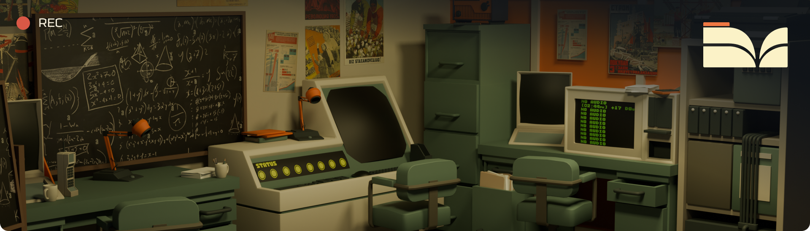
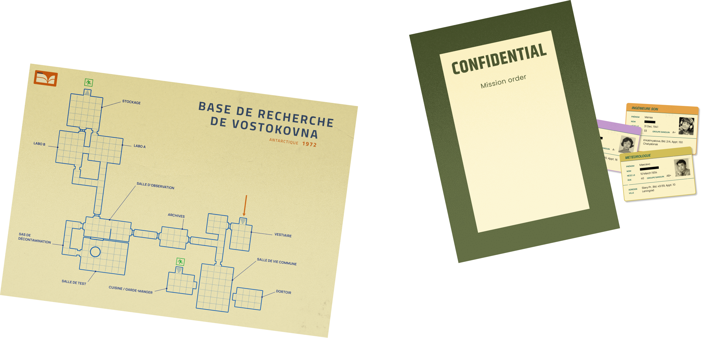
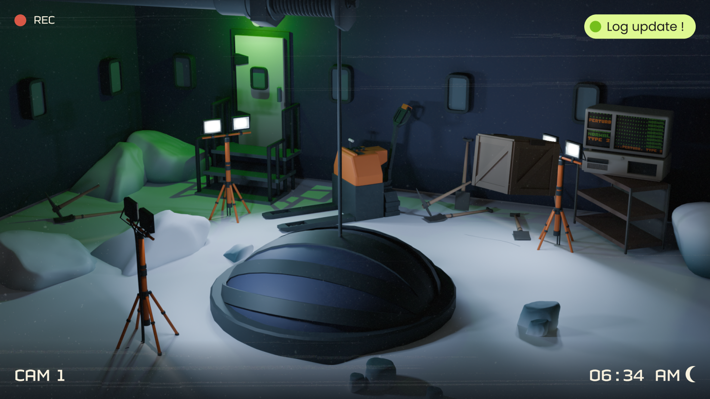

# **The Vostoknova Files**

 

## Presentation

>Game Made on ENJMIN 2024 Inclusivity & Connectivity
>
>10 people team on 4 full-days work
---
>### Strange things are happening at the Vostokovna research base in Antarctica...

With the help of a strange clock* with multiple dials, you're in charge of investigating by digging through the various CCTV images.
Can you figure out what might have happened?

## Alternative Controller
The game has been designed to be played with an alternative controller, although it can also be played with the keyboard.

// The controller isn't fully functionnal due to broken lineal pentiometer.
// When we'll be able to repair it, I'll add photos of the controller.

## Screenshot

## Team

| Member  |   |
| ----- | - |
| 🎲 [Gabriel Ducray](https://balbadur.itch.io/)                        | Game Design               |
| 🎲 [Maxence Martiniani](https://dotsquare.itch.io/)                   | Game Design               |
| 🎲 [Maurine Bastian](https://maureen-bst.itch.io/)                    | Game Design               |
| 💻 [Théophile Carrasco](https://eyecrown.itch.io/)                    | Developer                 |
| 💻 [Tristan Badana](https://kodaen.itch.io/)                          | Developer                 |
| 🧠 [Alexandre Agniel-Roux](https://alexandre-agniel.jimdosite.com/)   | UR & UX/UI Designer       |
| 🖌️ [Marine Mousset](https://marine-mousset.itch.io/)                  | Graphic & UX/UI Designer  |
| 🖌️ [Victorien Prévot](https://victorien-prevot.itch.io/)              | Visuals                   |
| 🖌️ [Gabriel Purnelle](https://shinobouu.itch.io/)                     | Visuals                   |
| 🎵 [Matteo Blivet](https://mblivet.itch.io/)                          | Sound Design              |